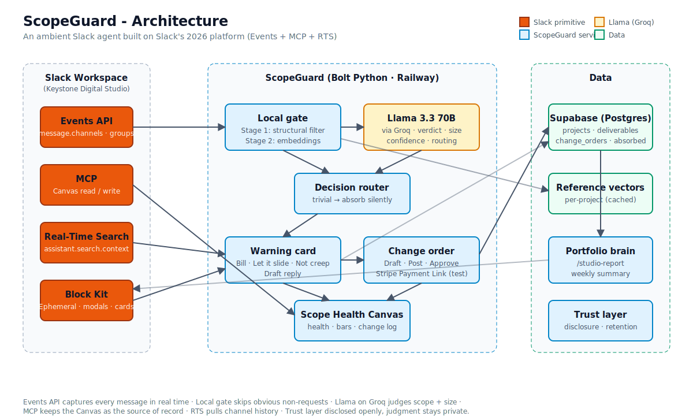

# ScopeGuard - Architecture

This document describes how the Slack app is structured: message flow, data model, key modules, and reliability patterns.

**Codebase:** `app/`  
**Run:** `python app.py` from `app/` with `.env` configured  
**Tests:** 108 unit tests (`pytest tests/ -q`)  
**Judge brief:** [docs/FOR_JUDGES.md](./docs/FOR_JUDGES.md) · diagram: [docs/architecture.svg](./docs/architecture.svg)



---

## 1. System overview

ScopeGuard is a Bolt for Python app for **freelancer–client project channels**. It:

1. Captures an agreed project brief and creates a **Scope Health** canvas
2. **Ambiently listens** to client messages and classifies them against the brief
3. **Privately warns** the freelancer when scope may have expanded
4. Drafts **change orders** (cost + timeline) and posts them in-thread
5. Updates **Scope Health** on the canvas and supports a **stub payment** flow
6. Tracks absorbed work, revision limits, client patterns, and retention

---

## 2. Message pipeline

```
Slack channel message (Events API)
        │
        ▼
  Pre-filter (bots, edits, DMs, short text, non-project channels)
        │
        ▼
  Disclosure gate (disclosure_ts set, classification_enabled)
        │
        ▼
  Client-only filter (only designated client_slack_id)
        │
        ▼
  Mockup classifier (optional: PNG/PDF + request context)
        │                    │
        │ no file            ▼
        ▼              Vision classification
  Embedding gate (local, Stage 1 regex + Stage 2 embeddings)
        │
        ├── SKIP ──► no classifier call, no action
        │
        └── ESCALATE
                │
                ▼
        Scope classifier (IN_SCOPE / OUT_OF_SCOPE / AMBIGUOUS
                       + size / value / revision)
                │
                ▼
        Severity router (auto-absorb trivial/small | warn significant/major
                         | revision limit breach)
                │
                ▼
        RTS prior-mention search (post-disclosure only)
                │
                ▼
        Ephemeral warning card (freelancer only)
                │
                ▼
        Change order flow → ScopeGuard draft → edit modal → public thread card
                │
                ▼
        Supabase update + Canvas full rebuild + optional payment link
```

### Why three Slack primitives

| Primitive                            | Role                                                |
| ------------------------------------ | --------------------------------------------------- |
| **Events API**                       | Real-time listening in project channels             |
| **Canvas API / MCP**                 | Scope-of-record document (brief + health scorecard) |
| **RTS (`assistant.search.context`)** | “Already raised on {date}” enrichment on warnings   |

---

## 3. Technology stack

| Layer         | Technology                                                                                | Role                                      |
| ------------- | ----------------------------------------------------------------------------------------- | ----------------------------------------- |
| Runtime       | Bolt + Socket Mode                                                                        | Events, modals, Block Kit                 |
| Pre-filter    | `embedding_gate.py` + `prefilter.py` + MiniLM embeddings                                  | Skip non-requests locally (~5–15 ms)      |
| Brain         | **Groq · Llama 3.3 70B** (`classifier.py`, `change_order_drafter.py`, `reply_drafter.py`) | Scope detection, CO drafting, reply draft |
| Brief import  | Anthropic vision/text extractors (`brief_extractor.py`, `scope_extractor.py`) where used  | SOW / chat → setup modal prefills         |
| Data          | Supabase (Postgres)                                                                       | Source of truth                           |
| Canvas create | Slack MCP (`slack_mcp.py`)                                                                | Initial Scope Health canvas on setup      |
| Canvas update | Web API `canvases.edit` (`slack_canvas.py`, `canvas_updater.py`)                          | Full document replace on every sync       |
| History       | RTS (`rts_search.py`)                                                                     | Prior mention search in channel           |

### Classifier / drafter evolution

| Version       | Stack                               | Why                                                                            |
| ------------- | ----------------------------------- | ------------------------------------------------------------------------------ |
| v1            | Anthropic Claude Sonnet             | Strong baseline; higher latency/cost for ambient classify                      |
| v2–v3 prompts | Same family, tighter scope rules    | Edge cases (“discussed but not in brief”)                                      |
| **Current**   | **Groq Llama 3.3 70B** + v3 prompts | Fast enough for live Slack warnings; benchmarked for classify + CO/reply draft |

User-facing product copy never names providers or models - only this architecture doc and `.env` do.

### Embedding gate safety invariant

The gate returns only `SKIP` or `ESCALATE` - never a scope verdict. A wrong skip means ignoring chatter, not missing creep. When in doubt, escalate. If the local model fails to load, Stage 2 is disabled and unsure messages always escalate.

---

## 4. Data model

Schema: `app/db/schema.sql` + `app/db/migrations/002_tier1_v2.sql`

| Table            | Purpose                                                                                                                                             |
| ---------------- | --------------------------------------------------------------------------------------------------------------------------------------------------- |
| `projects`       | One row per channel: freelancer, client, budget, deadline, `canvas_id`, `scope_health`, `disclosure_ts`, `retention_days`, `classification_enabled` |
| `clients`        | Cross-project client identity (freelancer + client Slack pair)                                                                                      |
| `deliverables`   | In-scope items from setup, `/update-brief`, or paid change orders                                                                                   |
| `change_orders`  | Flags + proposed/paid COs; size, estimated value, client_id, origin                                                                                 |
| `absorbed_items` | Let-it-slide and auto-absorbed work                                                                                                                 |
| `revisions`      | Revision round tracking per deliverable                                                                                                             |

**Change order statuses:** `flagged` → `proposed` → `paid` (or `dismissed`)

**Scope Health:** Weighted score from budget, time, and absorbed work (`scope_health.py`). Canvas shows committed vs projected breakdown.

**Paid COs fold into scope:** Marking a CO paid inserts a `deliverables` row with `origin='change_order'` so future messages about that work classify as in-scope.

---

## 5. Feature modules

### 5.1 Project setup - `/setup-brief`

**Files:** `listeners/commands/setup_brief.py`, `setup_brief_buttons.py`, `setup_brief_modal.py`

1. Ephemeral launcher → modal (project name, deliverables, budget, deadline, client)
2. On submit: insert `projects` + `deliverables`, create canvas via MCP, post disclosure
3. Guards: one brief per channel, setup lock, client ≠ freelancer

### 5.2 Brief import - `/import-brief`

**Files:** `import_brief_flow.py`, `brief_extractor.py`, `listeners/commands/import_brief.py`

Extracts deliverables and metadata from a SOW/brief document, then opens the setup modal prefilled.

### 5.3 Living brief - `/update-brief`

**Files:** `brief_update.py`, `update_brief_*.py`

Edits scope in place, preserves change-order deliverables, refreshes canvas.

### 5.4 Ambient classification

**Files:** `listeners/events/message.py`, `classifier.py`, `classifier_router.py`, `embedding_gate.py`, `embedding_cache.py`, `scope_warnings.py`

- Only messages from `client_slack_id` after disclosure
- Long messages truncated to 4k chars (head + tail)
- Router: trivial/small OUT_OF_SCOPE → silent auto-absorb; significant/major → warn; revision breach → warn
- One warning per message (idempotent on `trigger_message_ts`)

**Warning card actions:** Generate Change Order · Let it slide · Not scope creep · Draft reply

### 5.5 Change orders

**Files:** `change_order_flow.py`, `change_order_drafter.py`, `change_order_modal.py`, `change_order_card.py`

**Entry points:** warning button, `/change-order`, message shortcut **Flag as scope change**

1. Loading modal within 3s (`views.open` before heavy work)
2. ScopeGuard drafts task, cost, timeline
3. Freelancer edits → post to channel
4. Canvas refreshed; scope health updated

### 5.6 Canvas (v2 scorecard)

**Files:** `scope_canvas.py`, `canvas_model.py`, `canvas_sync.py`, `canvas_updater.py`, `slack_canvas.py`

- Full document replace on every sync (incremental section edits disabled - caused duplicate blocks)
- Sections: health score, budget/time bars, in-scope list, added & agreed, pending CO table, change log

### 5.7 Trust and retention

**Files:** `retention.py`, `member_joined.py`, `projects.py`

- Visible disclosure on setup; intro on bot join
- Retention purge nulls expired message text; runs on startup + every 6h
- Unflagged messages never written to DB

### 5.8 Payments (stub)

**Files:** `payment_buttons.py`, `change_order_card.py`, `freelancer_client.py`

- Public CO card: details only (“Awaiting client approval”)
- **Approve & Pay** / **Simulate payment:** client-only ephemeral (designated `client_slack_id`)
- Card message updates use the freelancer user token (CO was posted as the freelancer)
- No Stripe webhook — real payments do not auto-update Slack

---

## 6. Reliability patterns

### Operation locks (`operation_locks.py`)

In-memory TTL locks (120s default):

| Key                          | Purpose                   |
| ---------------------------- | ------------------------- |
| `setup:{channel}`            | One setup at a time       |
| `canvas:{project_id}`        | Canvas sync serialization |
| `bootstrap:{channel}:{user}` | CO bootstrap              |
| `draft:{change_order_id}`    | Generate CO button        |
| `change_order_submit:{id}`   | Modal submit              |
| `pay:{id}`                   | Simulate payment          |

### Modal timing (`slack_modals.py`)

`open_view_with_trigger()` calls `views.open` **before** `ack()` to beat the ~3s `trigger_id` expiry. Slash commands use a launcher-button pattern.

### Ephemeral lifecycle (`ephemeral_updates.py`)

Status messages update in place (setup creating → success, CO posting → posted).

### User copy (`user_messages.py`)

All user-facing strings centralized for consistent tone.

---

## 7. Configuration

See `app/.env.sample`. Required: Slack bot + app tokens, user token, Supabase, and Groq (`GROQ_API_KEY`). Optional Anthropic key if brief/document extractors are enabled.

**Manifest scopes:** chat, commands, history, files (mockup vision), canvas, RTS. MCP enabled for canvas create.

---

## 8. File map

| Area                | Key files                                                                         |
| ------------------- | --------------------------------------------------------------------------------- |
| Entry               | `app.py`, `listeners/__init__.py`                                                 |
| Setup               | `commands/setup_brief.py`, `views/setup_brief_*.py`                               |
| Import/update brief | `import_brief_flow.py`, `brief_update.py`, `brief_extractor.py`                   |
| Classify            | `events/message.py`, `classifier.py`, `classifier_router.py`, `embedding_gate.py` |
| Trust               | `projects.py`, `retention.py`, `events/member_joined.py`                          |
| Warnings            | `scope_warnings.py`, `warning_card.py`, `scope_creep_buttons.py`                  |
| Change orders       | `change_order_flow.py`, `change_order_drafter.py`, `views/change_order_*.py`      |
| Canvas              | `scope_canvas.py`, `canvas_sync.py`, `slack_canvas.py`, `slack_mcp.py`            |
| Health              | `scope_health.py`, `change_orders.py`                                             |
| Data                | `db/schema.sql`, `db/supabase_client.py`, `project_context.py`                    |
| Copy                | `user_messages.py`                                                                |

---

## 9. Test coverage

108 unit tests across: classifier gate/router, prefilter, embedding gate (+ corpus safety), message text, warning/CO cards, canvas, scope health, RTS, locks, idempotency, brief template, retention, absorbed, revisions, client report, modals.

No automated E2E against live Slack.

---

## 10. Known limitations

| Area                         | Status                                            |
| ---------------------------- | ------------------------------------------------- |
| Stripe webhook               | Not built - simulate or manual                    |
| Multi-instance               | In-memory locks only                              |
| Supabase RLS                 | Open (dev)                                        |
| Image-only requests          | Skipped unless mockup classifier applies          |
| Multiple clients per channel | One `client_slack_id` only                        |
| Production deploy            | Local Socket Mode - HTTP/OAuth via `app_oauth.py` |

---

## 11. End-to-end happy path

1. Freelancer runs `/setup-brief` → canvas at Scope Health 100%
2. Client: _“can you also add a blog section while you're at it?”_
3. Freelancer sees private warning
4. **Generate Change Order** → edit cost/timeline → **Post to channel**
5. Client sees thread card → approve/pay (or simulate in demo)
6. Canvas shows updated health + change log; paid work folds into brief
